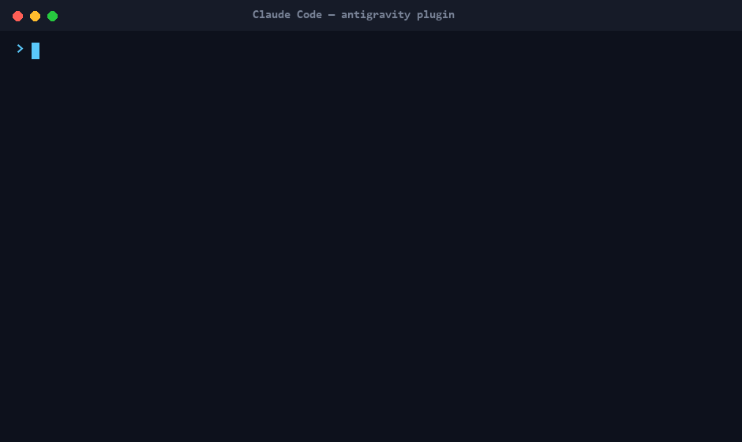

# Antigravity Plugin for Claude Code

> **A local NotebookLM — and 14 more commands — for Claude Code, powered by Google Antigravity (`agy` / Gemini 3.x), the official CLI that replaces the now-deprecated `gemini-cli`. Read whole folders of documents, transcribe audio & video, and research the web with citations — locally, offloading the heavy reading to Gemini so it barely touches Claude's context.**

**Project page:** [traidagency.com/labs/antigravity](https://traidagency.com/labs/antigravity) — built by [TRAID](https://traidagency.com).

[](LICENSE)
[](https://docs.claude.com/en/docs/claude-code/plugins)
[](https://antigravity.google)
[](https://github.com/MarcosNahuel/antigravity-plugin-cc)
[](https://developers.googleblog.com/an-important-update-transitioning-gemini-cli-to-antigravity-cli/)
[](https://github.com/MarcosNahuel/antigravity-plugin-cc/releases) [](https://github.com/MarcosNahuel/antigravity-plugin-cc/stargazers)

> ### ⚠️ Heads-up: `gemini-cli` shuts down on **June 18, 2026**
>
> On **May 19, 2026** Google announced at I/O that Antigravity CLI (`agy`) replaces Gemini CLI. After **June 18, 2026** the old `gemini-cli` and Gemini Code Assist IDE extensions **stop serving requests** for AI Pro, Ultra, and free-tier users.<sup>[[1]](https://developers.googleblog.com/an-important-update-transitioning-gemini-cli-to-antigravity-cli/) [[2]](https://www.theregister.com/ai-ml/2026/05/20/bye-bye-gemini-cli-google-nudges-devs-toward-antigravity/5243605)</sup>
>
> Google's stated reasoning: *"Your workflows have simply outgrown those early days of 2025. You now require multiple agents communicating with each other to split up the work and solve complex problems."* — [Google Developers Blog](https://developers.googleblog.com/an-important-update-transitioning-gemini-cli-to-antigravity-cli/)
>
> **If you were using [`gemini-plugin-cc`](https://github.com/abiswas97/gemini-plugin-cc) inside Claude Code, this plugin is your migration path.** It targets `agy` directly. Enterprise users on Code Assist Standard/Enterprise licenses are not affected by the cutoff.

**TL;DR** — `/agy:notebook <folder> | <objective>` turns a folder of documents into a **local NotebookLM**: one objective-driven summary per document, a relevance `INDEX.md`, a cited `RESUMEN_MAESTRO.md`, a `TIMELINE.md` and an `ENTIDADES.md` — then `/agy:notebook-ask` answers questions over them **with citations**. All the heavy reading runs in Gemini 3.x via `agy`, so it barely touches Claude's context. Plus **audio & video transcription** (`/agy:transcribe`, `/agy:media`), deep web research with citations, branded HTML reports, git-diff code review, doc-to-markdown, browser recording and more. **No Node.js runtime. No MCP gymnastics. Fifteen slash commands.**

[**Install**](#install) · [**Slash commands**](#slash-commands) · [**Examples**](#usage-examples) · [**FAQ**](#faq) · [**Compare to alternatives**](#compared-to-alternatives) · [**Project page**](https://traidagency.com/labs/antigravity)

> **Install — the canonical repo (accept no look-alikes):**
>
> ```
> /plugin marketplace add MarcosNahuel/antigravity-plugin-cc
> /plugin install antigravity@marcosnahuel-antigravity
> ```
> Requires the `agy` CLI installed + a Google/Antigravity sign-in. Then `/agy:setup`.

<p align="center">
  
</p>

---

## What is this?

**A Claude Code plugin that lets you delegate work to Google Antigravity CLI (`agy`) without leaving Claude Code.**

- **Antigravity CLI** (`agy`) is Google's official agentic command-line assistant — released at Google I/O 2026 as the successor to `gemini-cli`. Rewritten in Go for speed, with native web-search grounding built into Gemini 3.x and **multi-provider model support** (Gemini, Claude, GPT-OSS).
- **Claude Code** is Anthropic's CLI for AI-assisted software engineering.
- This plugin **bridges the two**: from inside Claude Code, you invoke `/agy:notebook`, `/agy:research`, `/agy:report`, `/agy:ask`, `/agy:review`, `/agy:rescue`, `/agy:record`, `/agy:scrape`, `/agy:doc-to-md`, `/agy:design-review`, or `/agy:setup` and the request gets handed to `agy --print` via a thin Bash forwarder.

The killer use case is **deep web research with citations** — Claude reasons over your repo, `agy` reasons over the live web. Each tool does what it's best at.

---

## 🗒️ Flagship: a local NotebookLM — `/agy:notebook`

Point it at a **folder of documents** (PDFs with text, scanned PDFs, images, docx) and an
**objective**. `agy` (Gemini 3.x, multimodal) reads every document — OCR'ing the scans — and writes:

- one **objective-driven summary per document** (`NN-<slug>.resumen.md`, with `relevancia` 0–100),
- **`INDEX.md`** — every document ranked by relevance to your objective,
- **`RESUMEN_MAESTRO.md`** — a synthesis that answers your objective, **citing each source document**,
- **`TIMELINE.md`** — a chronological table of dated events, and
- **`ENTIDADES.md`** — extracted people, amounts, references and organizations, each with its source.

Then ask follow-up questions over the corpus:

```text
/agy:notebook  ./expediente  | objective: parties, key dates, amounts, status
/agy:notebook-ask  ./expediente  | who started the file and on what date?
→ "The file was opened by J. Doe on 2022-07-08." (cites PV-2022-04770554)
```

Why it's different from pasting docs into a chat:

- **Cheap on Claude tokens** — Claude orchestrates; `agy` does all the document reading. You only
  read the two small final files.
- **Grounded + cited** — answers come only from your documents, with the source named.
- **Incremental** — re-running only re-summarizes new/changed documents (cache keyed by the objective).
- **Model-routed** — fast `Flash` for the per-doc sweep, `Pro` for the synthesis (`/agy:model`).
- **Local & private** — your documents never leave your machine + your own Gemini account.

It scales to real corpora: a 184-page scanned file is auto-split into page chunks so a single huge
scan doesn't time out. Built for reading **legal expedientes, RFPs, research folders, contract sets**.


---

## When should I use this plugin?

| If you are… | This plugin helps because… |
|---|---|
| A Claude Code user who needs **fresh information from the web** with verifiable URLs | `/agy:research` returns a structured markdown report with cited sources, written to a file you can edit, review, and commit. |
| Already using `agy` from the terminal but **switching between two CLIs** breaks your flow | You stay in Claude Code for code work. `/agy:*` handles everything that needs `agy`. |
| Evaluating a new library, framework, or service and need a **Tech Radar–style report** | `/agy:research --intensity high` pulls 15+ primary sources (papers, official docs, repos), triangulates them, and emits a comparative analysis with confidence levels. |
| Building a **proposal, RFP response, or technical pitch** | `/agy:research --intensity medium` produces an 8–12 source executive summary you can paste into a doc with citations intact. |
| Migrating from the old `gemini-plugin-cc` (built on the deprecated `gemini-cli`) | This plugin uses the new `agy` CLI and has no Node.js companion runtime — drop-in replacement for research workflows. |

---

## Slash commands

| Command | What it does |
|---|---|
| `/agy:notebook <folder> \| <objective>` | **Local NotebookLM.** Sweeps every document in a folder (PDF/scan/image/docx, hybrid text + multimodal OCR) into an objective-driven summary per doc, then a relevance `INDEX.md` and a cited `RESUMEN_MAESTRO.md`. All heavy reading runs in agy; the orchestrator only reads the two final files. Saves to `docs/agy/notebook/<folder>/`. |
| `/agy:notebook-ask <folder> \| <question>` | **Chat over a notebook corpus** — answers from the per-doc summaries built by `/agy:notebook`, with citations. Cheap; never re-reads the originals. Saves a Q&A trail. |
| `/agy:transcribe <audio\|video\|URL> [focus]` | **Transcribe + summarize audio or video** (or a YouTube/remote URL) with Gemini — voice notes, meetings, calls, screencasts. Timestamps for video. *Claude can't hear; agy can.* Saves to `docs/agy/transcripts/`. |
| `/agy:media <file\|URL> \| <question>` | **Multimodal Q&A over audio / video / image** — "what decisions were made?", "what happens at 2:30?", "what's the tone?". Grounded, with time references. Saves to `docs/agy/media/`. |
| `/agy:model [alias\|"label"]` | **Show or switch the agy model** by writing `settings.json` (the reliable lever; `--model` is unreliable). Aliases: `flash-low`, `pro`, `pro-high`, `sonnet`, `opus`, `gpt-oss`. No agy call, no reinstall. |
| `/agy:research <topic> [--intensity low\|medium\|high]` | **Deep web research.** Saves to `docs/agy/research/YYYY-MM-DD-<slug>.md`. Default: `medium`. |
| `/agy:report <markdown> [--template <id>] [--images native\|external\|none]` | **Branded HTML document from a markdown source** using the TRAID Design System (5 templates) — turns your `.md` (with `![generate: ...]` cues) into a publication-grade page with infographics. Saves to `docs/agy/reports/`. See [Infographics](#documents-with-infographics--agyreport). |
| `/agy:ask <prompt>` | **One-shot quick prompt** to agy; returns the answer verbatim, no file persistence. |
| `/agy:review [focus]` | **Code review** of the current `git diff` with optional focus. |
| `/agy:rescue [--resume\|--fresh] <task>` | **Delegate** a coding, debugging, or implementation task to `agy` and return its output verbatim. |
| `/agy:record <url> [steps in natural language]` | **Browser walkthrough recording.** Drives an isolated Chrome via agy's browser subagent, produces `.webm` + screenshots + report, optional MP4 conversion if ffmpeg is on PATH. Saves to `docs/agy/recordings/`. No audio. |
| `/agy:scrape <url> [schema] [--json]` | **Structured data extraction** from a single URL. Output as markdown table (default) or JSON. Saves to `docs/agy/scrapes/`. For one-off extractions, not production pipelines. |
| `/agy:doc-to-md <file> [focus]` | **PDF / docx / image → clean Markdown** via multimodal Gemini. Preserves tables, lists, headings. Saves to `docs/agy/converted/`. Ideal for ingesting RFPs and client specs. |
| `/agy:design-review <url> [focus]` | **UX/visual design audit** — desktop + mobile screenshots, 10-dimension scoring (hierarchy, typography, color, a11y, etc.), top 3 strengths, top 3 improvements, overall /10 score. Saves to `docs/agy/design-reviews/`. |
| `/agy:setup` | **Health check** — resolves the binary, reads version, runs a 30 s ping. |

### Research intensity matrix

| Intensity | Timeout | Source target | Output sections |
|---|---|---|---|
| `low` | 3 min | 3–5 trusted sources | TL;DR · Sources |
| `medium` | 8 min | 8–12 triangulated | Executive summary · Key findings · Analysis · References |
| `high` | 20 min | 15+ primary sources | TL;DR · Context · Findings · Comparisons · Risks · Evidence gaps · Conclusion · References |

> **Model selection (updated v0.6.1)**: early `agy` 1.0.0/1.0.1 rejected `--model` (`flags provided but not defined: -model`), so this plugin removed it in v0.1.1. **agy 1.0.5+ accepts `--model "<name>"` again** (e.g. `--model "Gemini 3.1 Pro (High)"`). Because the plugin can't know your installed version at call time, it still **defaults to letting `agy` pick** (Gemini 3.5 Flash for casual prompts, Gemini 3.5 Pro for heavier work) for cross-version safety. If you're on 1.0.5+ and want a specific model, set it in `agy`'s interactive settings. Provider routing (Claude / GPT-OSS via `agy`) works through `agy`'s own configuration.

---

## Install

### 1. Prerequisites

You need both CLIs installed and authenticated:

**Claude Code** ([install guide](https://docs.claude.com/en/docs/claude-code/overview)):

```bash
npm install -g @anthropic-ai/claude-code
```

**Antigravity CLI** (`agy`):

```powershell
# Windows (PowerShell)
irm https://antigravity.google/cli/install.ps1 | iex
```

```bash
# macOS / Linux
curl -fsSL https://antigravity.google/cli/install.sh | bash
```

Then run `agy` once in a fresh shell to complete Google OAuth login. After that the CLI is good for non-interactive use via `--print`.

### 2. Add the plugin

From inside Claude Code:

```
/plugin marketplace add MarcosNahuel/antigravity-plugin-cc
/plugin install antigravity@marcosnahuel-antigravity
```

> **Also on npm** (discovery / versioning): [`antigravity-plugin-cc`](https://www.npmjs.com/package/antigravity-plugin-cc). Run `npx antigravity-plugin-cc` to print these install commands. Note the plugin is markdown + JSON with no runtime — Claude Code installs it from the marketplace above, so npm is a mirror, not the install path.

### 3. Verify

```
/agy:setup
```

You should see the binary path, version, and a `pong` from a 30-second test ping.

---

## Usage examples

### Quick fact check — `low` intensity

```
/agy:research n8n self-hosted telemetry environment variables --intensity low
```

→ 3–5 bullet TL;DR with official-doc URLs, in under 3 minutes. Saved to `docs/agy/research/2026-05-23-n8n-self-hosted-telemetry-environment-variables.md`.

### Tech radar evaluation — `medium` intensity (default)

```
/agy:research feature flags postgres vs redis tradeoffs 2026
```

→ Executive summary · 8–12 triangulated sources · analysis · numbered references with dates.

### Strategic decision — `high` intensity

```
/agy:research modular ERP architecture for MercadoLibre sellers in Latam --intensity high
```

→ 15+ primary sources · comparative tables · counterarguments · evidence gaps · confidence-rated conclusion. ~20 minutes.

## Documents with infographics — `/agy:report`

The flagship document workflow: **you (or Claude) write a clean source `.md`, agy turns it into a branded, publication-grade HTML document with infographics.** Drop `![generate: <description>]` cues in the markdown wherever you want a generated visual.

```
/agy:report docs/specs/traid-pitch.md --template traid-dark --images external
```

How images are produced is controlled by `--images`:

| Mode | Behavior | Use when |
|---|---|---|
| `native` (default) | agy generates each image itself | quick drafts; zero setup (quality is inconsistent in headless agy — missing images are reported, never shipped silently) |
| `external` | you pre-generate the PNGs (e.g. **Nano Banana 2** / `gemini-3.1-flash-image-preview`) into the `.assets/` dir; agy references them | **client / brand-grade infographics** — deterministic, real PNGs, full control |
| `none` | styled placeholder boxes instead of images | text-first docs, or art added later |

Recommended pipeline for polished output: write the `.md` → pre-generate the infographics with your image model into `<output>.assets/<slug>.png` (slug = description kebab-cased) → run `/agy:report ... --images external`. After generation the plugin verifies every `` resolves to a real file and reports any missing.

> Tip: opening the result via `file://` can block local image loading in some browsers — serve with `python -m http.server` and open over `http://`.

### Code rescue / task delegation

```
/agy:rescue debug why my drizzle migration drops the foreign key constraint on user_id
```

→ Hands the task to `agy` with `--dangerously-skip-permissions`. `agy` reads files, proposes edits, returns its output. You see it verbatim.

### Resume the previous `agy` conversation

```
/agy:rescue --resume apply the top fix you suggested
```

→ Equivalent to `agy --print --continue "apply the top fix you suggested"`. Useful for tight iteration loops.

---

## How it works under the hood

```
You → Claude Code → /agy:research <topic>
                        ↓
          antigravity:agy-rescue subagent
                        ↓
          Bash → agy --print --print-timeout <N> "<wrapped-prompt>" < /dev/null
                        ↓
          stdout → Write → docs/agy/research/YYYY-MM-DD-<slug>.md
                        ↓
          path + TL;DR shown to you in Claude Code
```

The subagent is a **thin forwarder** — there is no companion runtime, no Agent Client Protocol (ACP) handling, no JavaScript. It picks the right prompt template per intensity, computes the timeout, shells out, captures stdout, writes the file, and returns.

This is intentionally simpler than [`abiswas97/gemini-plugin-cc`](https://github.com/abiswas97/gemini-plugin-cc) (~800 LoC of Node.js companion) because `agy --print` already handles the conversation lifecycle natively (`--continue`, `--conversation <id>`, `--print-timeout`).

---

## File layout

```
.
├── .claude-plugin/
│   └── marketplace.json            # marketplace manifest (root)
├── plugins/
│   └── antigravity/
│       ├── .claude-plugin/
│       │   └── plugin.json         # plugin manifest
│       ├── agents/
│       │   └── agy-rescue.md       # thin forwarder subagent
│       ├── commands/
│       │   ├── ask.md              # /agy:ask
│       │   ├── design-review.md    # /agy:design-review
│       │   ├── doc-to-md.md        # /agy:doc-to-md
│       │   ├── record.md           # /agy:record
│       │   ├── report.md           # /agy:report
│       │   ├── rescue.md           # /agy:rescue
│       │   ├── research.md         # /agy:research
│       │   ├── review.md           # /agy:review
│       │   ├── scrape.md           # /agy:scrape
│       │   └── setup.md            # /agy:setup
│       └── skills/
│           └── agy-prompting/
│               └── SKILL.md        # prompting tips for Gemini 3.x
├── bin/
│   └── cli.js                      # npx install helper
├── package.json                    # npm package (files allowlist + bin)
├── llms.txt                        # LLM-friendly index (GEO)
├── CITATION.cff                    # citation metadata
├── LICENSE                         # MIT
├── CHANGELOG.md                    # version history
└── README.md
```

---

## Compared to alternatives

| | This plugin | [`gemini-plugin-cc`](https://github.com/abiswas97/gemini-plugin-cc) | Claude's built-in `WebSearch` tool | Perplexity API |
|---|---|---|---|---|
| **CLI it wraps** | Antigravity (`agy`) — **official current CLI** | Gemini CLI — **shuts down 18 Jun 2026** ⚠️ | None (native to Claude) | None (REST API) |
| **Runtime overhead** | None — direct Bash to `agy` | ~800 LoC Node.js companion | None | HTTP calls |
| **Web search engine** | Gemini 3.x grounding (or Claude/GPT-OSS via `agy`) | Gemini 2.x via Gemini CLI | Brave (via Anthropic) | Perplexity Sonar |
| **Saves output to file** | ✅ `docs/agy/research/` by default | ❌ | ❌ | ❌ |
| **Intensity tiers** | ✅ low/medium/high | ❌ | ❌ | Some via model choice |
| **Code rescue / file edits** | ✅ via `/agy:rescue` | ✅ via `/gemini:rescue` | ❌ | ❌ |
| **Code review commands** | Not yet (roadmap) | ✅ `/gemini:review`, `/gemini:adversarial-review` | ❌ | ❌ |
| **Multi-provider models** | ✅ Gemini + Claude + GPT-OSS via `agy` | Gemini only | Claude only | Perplexity only |
| **Free tier** | Via Google's `agy` free quota | Via Gemini API free quota (ending Jun 2026) | Included in Claude Code | Paid |

**Rule of thumb:** Use Claude's `WebSearch` for quick lookups inside a Claude session. Use this plugin when you want **a saved, structured markdown report with citations** that lives in your repo and that you can iterate on. If you were on `gemini-plugin-cc`, plan your migration before 18 Jun 2026.

---

## FAQ

### When is Gemini CLI being deprecated, and what should I do?

**June 18, 2026.** That's the date `gemini-cli` and Gemini Code Assist IDE extensions stop serving requests for Google AI Pro, Ultra, and free-tier users.<sup>[[1]](https://developers.googleblog.com/an-important-update-transitioning-gemini-cli-to-antigravity-cli/)</sup> Install `agy` now (`irm https://antigravity.google/cli/install.ps1 | iex` on Windows, `curl -fsSL https://antigravity.google/cli/install.sh | bash` on macOS/Linux), and replace `/gemini:*` calls with `/agy:*`. Enterprise users on Code Assist Standard or Enterprise licenses are exempt and retain access.

### Can I still use the older `gemini-plugin-cc`?

Until 18 Jun 2026, yes. After that, the underlying `gemini-cli` will stop authenticating requests for non-enterprise users, so the plugin's slash commands will start failing. This repo is the natural migration target — same UX (slash commands forwarding to a Google CLI), updated to the supported binary.

### Why "Antigravity" — what's the name about?

Antigravity is Google's umbrella for its agent-first development stack: the Antigravity 2.0 desktop IDE, the Managed Agents in the Gemini API, and the Antigravity CLI (`agy`). The CLI shares the same agent harness as the desktop app, so future improvements ship to both at once.<sup>[[5]](https://blog.google/innovation-and-ai/technology/developers-tools/google-io-2026-developer-highlights/)</sup>

### How is this different from just running `agy` in a separate terminal?

You don't lose your Claude Code context. The output of `/agy:research` lands as a file in your project — Claude can immediately read it, summarize it, or use it as input to the next step. Two terminals + copy-paste is not the same workflow.

### Does this require an API key?

No. `agy` uses your Google OAuth login (the same one you set up the first time you ran `agy` interactively). This plugin shells out to `agy --print` and inherits that auth.

### What models does it use?

By default, whatever `agy` decides internally — the CLI default is Gemini 3.5 Flash for casual prompts, Gemini 3.5 Pro for heavier work. The `--model` flag was rejected by agy 1.0.0/1.0.1 but is **accepted again in agy 1.0.5+** (e.g. `--model "Gemini 3.1 Pro (High)"`). This plugin defaults to omitting it (cross-version-safe), so on any version you get `agy`'s configured default; set a specific model in `agy`'s interactive settings if you want one. The `agy` ecosystem can also route to Claude / GPT-OSS through its own configuration.

### Where does the research output get saved?

`docs/agy/research/YYYY-MM-DD-<slug>.md`, relative to the directory where you ran the slash command. Each file gets a YAML frontmatter block with `title`, `intensity`, `model`, `created`, `sensitivity`, `source_tool`. You can commit these to your repo — they're plain markdown.

### Can I change the output directory?

Not via flag yet. It's on the roadmap. For now, edit `plugins/antigravity/commands/research.md` and change the `WRITE_FILE` path.

### Does it work on Windows?

Yes. The subagent resolves the `agy` binary in this order: `AGY_BIN` env var → `agy` on PATH → `${LOCALAPPDATA}/agy/bin/agy.exe`. Tested on Windows 11 with Claude Code.

### What if `/agy:setup` hangs or returns empty?

In `agy` CLI 1.0.x–1.0.5, an empty stdout with exit code 0 is **ambiguous**. Three real causes — tail the latest `~/.gemini/antigravity-cli/log/cli-*.log` to tell them apart:

1. **Empty-stdout bug ([issue #76](https://github.com/google-antigravity/antigravity-cli/issues/76), most common in subprocess mode)**: the log shows `text_drip.go: Drip stopped: length=N` — the model *did* answer, but agy drops the bytes when stdout isn't a TTY. **The response is still on disk**, so v0.6.1 of this plugin recovers it automatically from the per-conversation transcript (`brain/<cid>/.system_generated/logs/transcript.jsonl`). The bug is still unfixed upstream as of agy 1.0.5.
2. **Headless auth timeout (agy 1.0.5)**: the log shows `keyringAuth: timed out` → `Print mode: auth timed out`. Here the model never ran. Open a regular terminal (not inside Claude Code), run `agy` once to refresh the keyring/OAuth session, then retry. v0.6.1 detects this and tells you instead of returning a silent empty result.
3. **Tool-call loop**: `agy`'s agentic mode may call `ListDir`/`Search`/`ReadFile` even for trivial prompts. The setup ping sends an explicit "do not use any tools" instruction to avoid this; if you still hit it, raise the timeout.

Also verify OAuth with `ls ~/.gemini/antigravity-cli/installation_id` (absent/empty → run `agy` interactively once to log in). See `CHANGELOG.md` for the v0.6.1 recovery details and v0.1.1 history.

### Does this plugin send my code anywhere?

For `/agy:rescue`, `agy` runs with `--dangerously-skip-permissions` so it can read and edit files in your repo. The data goes to Google's Gemini API per `agy`'s privacy policy — same as if you ran `agy` directly. For `/agy:research`, only the topic text and `agy`'s own web searches happen; your repo files are not sent.

### What's the difference between `/agy:research` and `/agy:rescue`?

`/agy:research` is **read-only**, web-focused, writes a markdown report to disk. `/agy:rescue` is **write-capable**, repo-focused, can edit your files. Different use cases, different prompts under the hood.

### Why not just use the official `agy mcp start` integration?

Two reasons:

1. The MCP integration exposes `agy` as a tool to Claude, but Claude decides when to call it. This plugin gives **you** explicit control via slash commands with structured prompts and intensity tiers.
2. The research-to-file workflow (`docs/agy/research/`) doesn't exist in the MCP setup. You'd build it yourself.

Both can coexist — they target different patterns.

### Can I use it without Claude Code (e.g., from Cursor, Windsurf, or another IDE)?

The plugin format is specific to Claude Code today. The prompt templates inside `plugins/antigravity/agents/agy-rescue.md` are reusable in any agent that can shell out to `agy --print`, though.

---

## Roadmap

- [ ] `/agy:review <files>` — code review of a path or diff
- [ ] `/agy:adversarial-review` — challenge-mode review (red-team approach, design tradeoffs, hidden assumptions)
- [ ] `/agy:adversarial-research <topic>` — research with explicit steelman + red-team framing
- [ ] `/agy:fact-check <claim>` — single-claim verification with citations
- [ ] `/agy:compare <A> vs <B>` — two-tool comparative report
- [ ] Configurable output directory (`AGY_RESEARCH_DIR` env var)
- [ ] CI mode (machine-readable JSON output)
- [ ] Cost estimate per intensity in the setup command
- [ ] `examples/` directory with real research outputs

PRs welcome. Open an issue first for anything bigger than a typo.

---

## Glossary

- **Antigravity CLI / `agy`** — Google's official agentic command-line assistant, written in Go, that replaced `gemini-cli` in 2026. Includes native web search grounding via Gemini 3.x. [Installer](https://antigravity.google/cli).
- **Claude Code** — Anthropic's official CLI for AI-assisted software engineering. Supports plugins, MCP servers, and subagents. [Docs](https://docs.claude.com/en/docs/claude-code/overview).
- **Claude Code plugin** — A folder with `.claude-plugin/plugin.json`, optional `commands/`, `agents/`, `skills/`, and `hooks/`. Installed via `/plugin install`. [Plugin docs](https://docs.claude.com/en/docs/claude-code/plugins).
- **Subagent** — A reusable agent definition in `agents/`. Can be invoked by Claude or by slash commands. This plugin uses a single `agy-rescue` subagent in three modes.
- **Slash command** — A custom `/<name>` shortcut defined in `commands/<name>.md`. This plugin ships `/agy:rescue`, `/agy:research`, `/agy:setup`.
- **`--dangerously-skip-permissions`** — `agy` flag that auto-approves all tool permission requests so it can run unattended. Required for `/agy:rescue` to be useful.
- **MCP** — Model Context Protocol. Standard for connecting LLM clients to tool servers. `agy mcp start` exposes `agy` as an MCP server; this plugin does NOT use that path and is independent of it.

---

## Cite this plugin

If this saved you work and you want to cite it (in a paper, blog post, talk), use:

```bibtex
@software{albornoz_antigravity_plugin_cc_2026,
  author = {Albornoz, Marcos Nahuel},
  title = {Antigravity Plugin for Claude Code},
  year = {2026},
  publisher = {GitHub},
  url = {https://github.com/MarcosNahuel/antigravity-plugin-cc}
}
```

A machine-readable `CITATION.cff` is in the repo root.

---

## Author

Built by **Marcos Nahuel Albornoz** — co-founder & PM at [**TRAID**](https://traidai.com), an automation & AI agency for e-commerce in Latam and the US.

- GitHub: [@MarcosNahuel](https://github.com/MarcosNahuel)
- Email: [contact@traidai.com](mailto:contact@traidai.com)

If this plugin saves you time, a ⭐ on the repo is the best way to say thanks. Pull requests, issues, and feature ideas all welcome.

---

## License

[MIT](LICENSE) — do whatever you want, no warranty.

---

## References

1. **Google Developers Blog (19 May 2026)** — [*"An important update: Transitioning Gemini CLI to Antigravity CLI"*](https://developers.googleblog.com/an-important-update-transitioning-gemini-cli-to-antigravity-cli/). Official announcement of the 18 Jun 2026 cutoff.
2. **The Register (20 May 2026)** — [*"Bye-bye, Gemini CLI; Google nudges devs toward Antigravity"*](https://www.theregister.com/ai-ml/2026/05/20/bye-bye-gemini-cli-google-nudges-devs-toward-antigravity/5243605). Independent coverage of the deprecation.
3. **NoeFabris / opencode-antigravity-auth** — [GitHub](https://github.com/NoeFabris/opencode-antigravity-auth). Reference for `agy` multi-provider auth covering Gemini Pro and Claude Opus.
4. **APIYI Blog** — [*"Antigravity vs Claude Code: 5 Key Differences for Using Claude Opus 4.6 Without Account Bans"*](https://help.apiyi.com/en/antigravity-vs-claude-code-free-claude-opus-no-ban-guide-en.html). Confirms multi-model routing through `agy`.
5. **Google Blog (19 May 2026)** — [*"I/O 2026 developer highlights: Antigravity, Gemini API, AI Studio"*](https://blog.google/innovation-and-ai/technology/developers-tools/google-io-2026-developer-highlights/). I/O 2026 launch context for Antigravity 2.0 + Gemini 3.5.

---

<sub>Keywords: claude code plugin, antigravity cli, agy cli, gemini 3.5, gemini cli deprecated, gemini cli replacement, gemini cli migration, june 18 2026, antigravity migration, deep web research, llm research tool, agentic engineering, prompt engineering, claude code subagent, gemini grounding, claude code marketplace, research with citations, llm tool delegation, claude opus from agy, multi-model cli, claude code anthropic.</sub>
